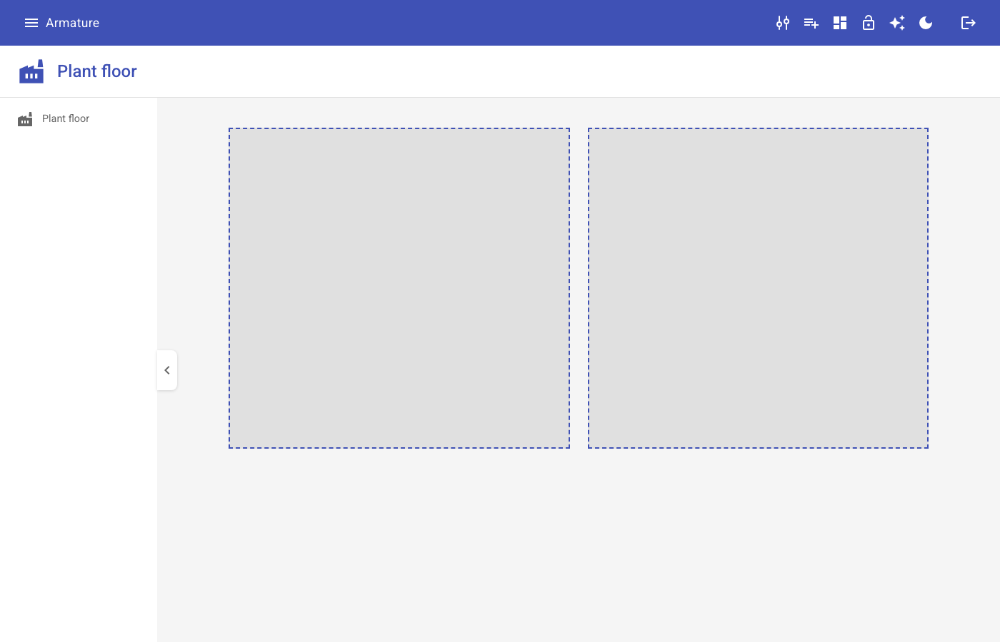
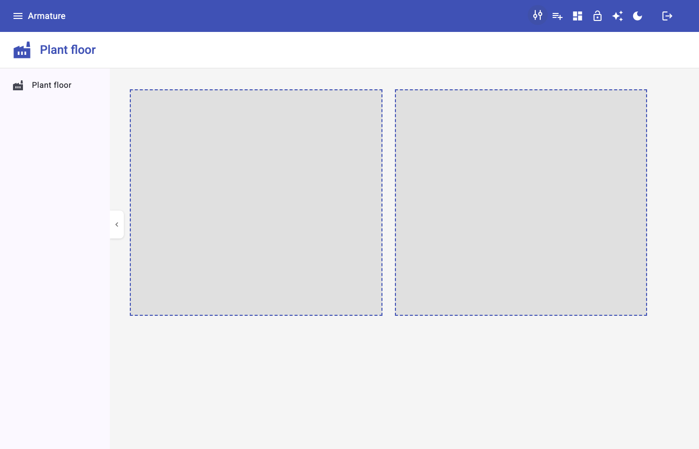
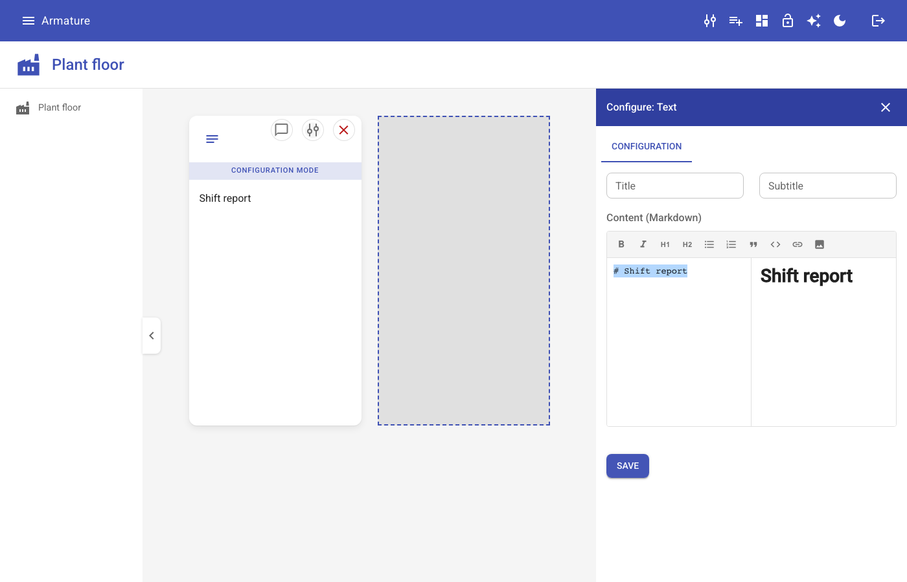
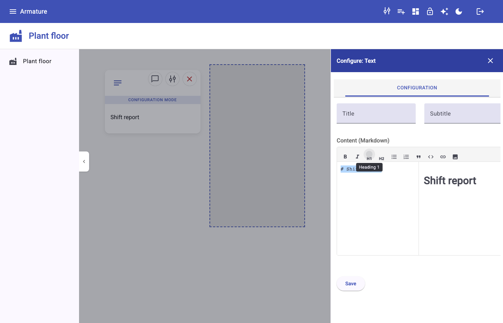
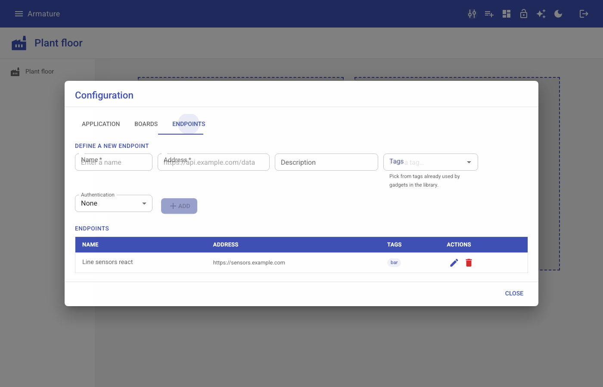
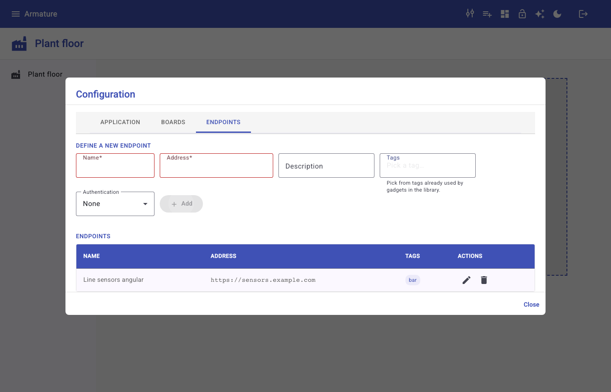
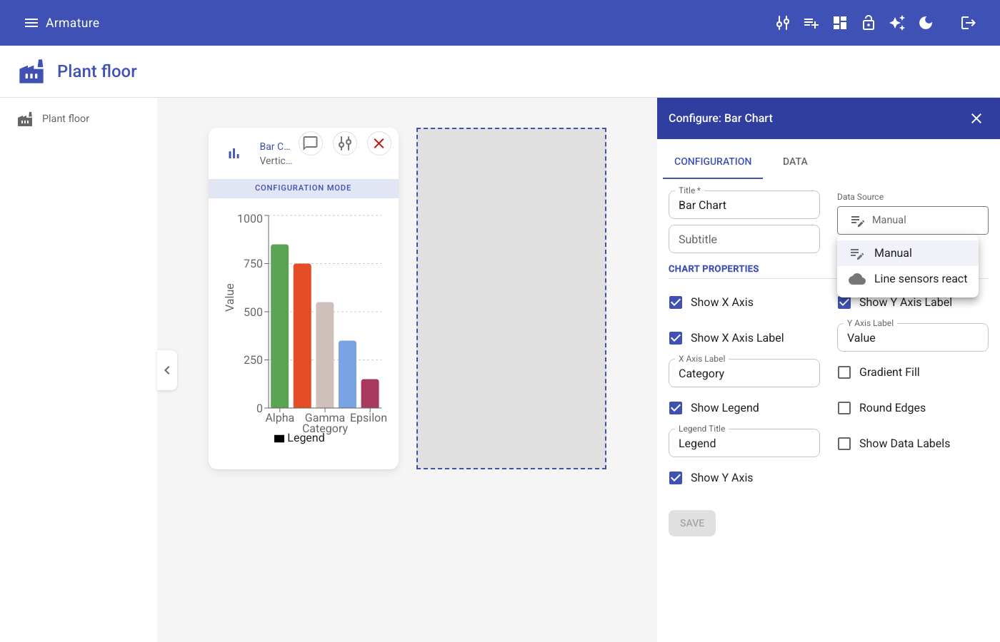
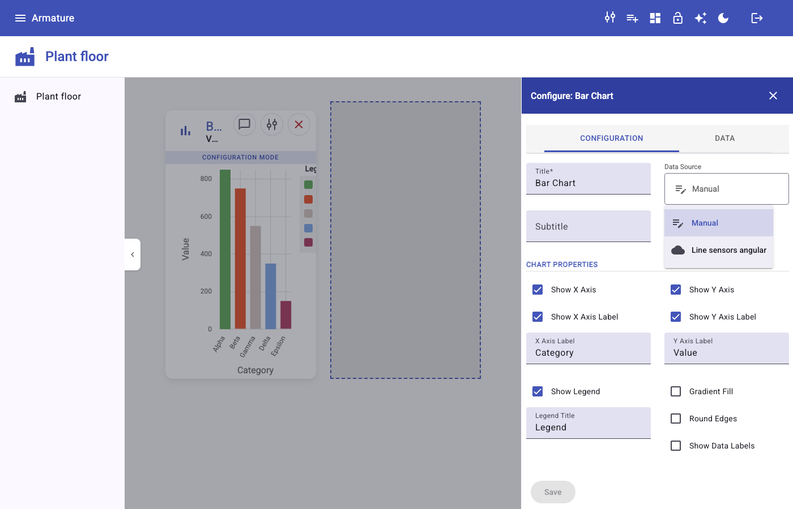

# INC-00d: React host parity, part 1 (settings and form controls)

Spec: [`.work/specs/SPEC-INC-00d.md`](../../.work/specs/SPEC-INC-00d.md). Branch:
`inc/00d-react-parity`, built on `inc/00c-modules-patterns` (INC-00c is not yet merged to `main`,
by the owner's choice).

## 1. Goal and vision link

Make the React host, the plan's reference host, do everything the Angular host does outside the
assistant, and prove it with one test suite that runs unchanged against both. Serves
**Consolidation** and **Deliver anywhere** indirectly: no new capability, but INC-01 onward builds
React first, and now starts from a host without gaps. It also starts the plan's host conformance
suite, which is how every later host (Lit, Svelte, vanilla) will prove parity.

## 2. What was built

### React host (`web/hosts/react`)

| Piece | Path | Replaces |
| --- | --- | --- |
| Icon picker (64 curated Material Icons, searchable grid) | `src/app/shared/icon-picker/` | Free text "Icon" field in Board settings; plain text input for `icon-picker` |
| Illustration menu and picker | `src/app/shared/illustrations/IllustrationMenu.tsx`, `IllustrationPicker.tsx` | Plain text input for `illustration-picker` |
| Markdown editor (toolbar, live preview, insert illustration with size) | `src/app/dynamic-form/markdown-editor/` | Plain textarea for `markdown` |
| Endpoints tab (CRUD, tags picked from the library vocabulary, authentication fields) | `src/app/configuration/tab-endpoints/` | Placeholder text |
| Endpoint service and tag options service | `tab-endpoints/endpoint.service.ts`, `src/app/shared/gadget-tags/` | Nothing |
| Endpoint picker (Manual plus endpoints sharing the gadget's tags) | `src/app/shared/endpoint-picker/` | Plain text input for `endpoint-picker` |
| `apiFetch` (token header, `Accept` rule of Angular's `TokenInterceptor`) | `src/lib/apiFetch.ts` | Nothing; host local, replaced by the `@armature/core` HAL client in INC-01 |
| `tabpanel` role on gadget property pages and on the Board settings dialog | `src/app/dynamic-form/DynamicForm.tsx`, `src/app/configuration/Configuration.tsx` | Unlabelled content under the tabs |
| Picker labels above the control, as in Angular (found in the real backend walk) | `src/app/dynamic-form/DynamicForm.css` | Label beside the button |

Every control type that `library.json` uses now has the same control in both hosts.
`PORTING_STATUS.md` lists what remains and which increment owns it.

### Angular host (`web/hosts/angular`)

- **Removed** the user and schedule datastores (`configuration/tab-user/`, `tab-schedule/`), their
  load in `HomeComponent`, the `driver`, `qc`, `lead`, `lunch` branch of
  `DynamicFormPropertyComponent`, and the two event subjects they used (also removed from the
  React `EventService`). No `library.json` entry used them; the Home load called the backend on
  every start for nothing.
- **Accessible names** on the icon, illustration, and endpoint pickers, the markdown editor
  toolbar, textarea and preview, and the endpoint row actions.
- **Bug fix:** Board settings now closes after adding a board. `closeDialog()` clicked a `#board`
  template reference that did not exist; it now uses `MatDialogRef`.
- **Bug fix:** the Endpoints tab shows "No endpoints defined yet." after the last endpoint is
  deleted. The app is zoneless and the HTTP response never scheduled change detection.

### Host conformance suite (`web/conformance`, new)

Playwright, roles and accessible names only, backend stubbed in memory per test
([`support/backend-stub.ts`](../../web/conformance/support/backend-stub.ts)). Five scenarios in
[`tests/settings-and-forms.spec.ts`](../../web/conformance/tests/settings-and-forms.spec.ts):

1. A board icon chosen in Board settings shows in the board list.
2. Markdown typed in the Text gadget editor renders in its preview and on the board.
3. An illustration picked for the Illustration gadget is shown on the board.
4. Endpoints can be created (with a tag), edited, and deleted in Board settings.
5. The Bar Chart gadget's data source is picked from endpoints that share its tags (an endpoint
   with other tags is not offered).

CI: [`.github/workflows/web-conformance.yml`](../../.github/workflows/web-conformance.yml) builds
the React host, serves it with `vite preview`, and runs the suite on changes under `web/`.

## 3. Diagrams changed

None. `docs/architecture/check-svg.sh`: "All 14 diagram(s) up to date". See "Not done and why"
for the conformance suite's absence from the C4 views.

## 4. Decisions

- [ADR-0017](../adr/0017-host-parity-before-feature-work.md): parity increments 00d and 00e go
  before INC-01, and parity is proven by the conformance suite. Accepted (owner request).
- Confirmed in the spec, no ADR needed: assistant split into INC-00e; RBAC directive not ported
  (superseded by HAL links in INC-01 and INC-02); dead datastores removed from Angular; CI runs
  the suite against React only.
- Plan and `ROADMAP.md` increment tables gained the 00d, 00e row (the only plan edit).

## 5. Evidence

| Check | Command | Result |
| --- | --- | --- |
| React build | `cd web/hosts/react && npm run build` | Pass |
| React lint | `npm run lint` | 0 errors, 3 warnings, all in files this increment did not touch (`Library.tsx`, `HelpPanel.tsx`, `Board.tsx`) |
| Angular build | `cd web/hosts/angular && npx ng build` | Pass (existing CommonJS and `styles.css` warnings unchanged) |
| Angular tests | `npx ng test --watch=false --browsers=ChromeHeadless` | 22 of 22 passed. Was 26: the 4 removed specs belonged to the deleted datastores |
| Conformance, React | `ARMATURE_HOST_URL=http://localhost:4173 npm test` (against `vite preview`) | 5 of 5 passed |
| Conformance, Angular | `ARMATURE_HOST_URL=http://localhost:4300 npm test` (against `ng serve --port 4300`) | 5 of 5 passed |
| Flakiness | `npx playwright test --repeat-each=8` on each host | 40 of 40 on React; 80 of 80 on Angular over two runs |
| Real backend walk | Temporary Playwright script, no stubs, backend on 8080 with JDK 25 (see below) | Passed on both hosts; no backend call returned an error |
| Suite types | `cd web/conformance && npm run typecheck` | Pass |
| Diagrams | `docs/architecture/check-svg.sh` | All 14 up to date |
| Backend, core | not run | No files under `backend/` or `web/packages/core` changed. The backend was started (`JAVA_HOME=~/.jdks/jdk-25.0.2/jdk-25.0.2+10/Contents/Home ./mvnw spring-boot:run`) for the walk only |

Demo script (either host): log in, open Board settings, Boards, choose the `factory` icon, add a
board; open the gadget library, add Text, Configure, type a line and press H1, watch the preview,
Save; open Board settings, Endpoints, add an endpoint tagged `bar`; add a Bar Chart, Configure,
pick that endpoint under Data Source.

Angular occasionally lost the board title typed right after switching to the Boards tab, which
left Add disabled (about 1 run in 20). This was a test timing issue, not a user facing bug: the
helper typed while the tab switch was still animating. `openSettings` in
[`support/host.ts`](../../web/conformance/support/host.ts) now waits for the tab to be selected
and its panel visible; React's settings dialog gained the `tabpanel` role that wait needs.

### Real backend walk

The monorepo backend ran on port 8080 under JDK 25. A temporary Playwright script (not committed)
drove each host with no stubs: create a board with the `factory` icon, add a Text gadget and
format a heading, remove it (confirming the dialog), create an endpoint tagged `bar` against the
real `/api/endpoints`, pick it as a Bar Chart's data source, save, then delete the endpoint. Both
hosts passed, and the script failed on any backend response of 400 or above (there were none).

| Step | React | Angular |
| --- | --- | --- |
| Board with chosen icon |  |  |
| Markdown editor and preview |  |  |
| Endpoints tab with a saved endpoint |  |  |
| Endpoint picker offering the endpoint |  |  |

What the walk found beyond the suite: React placed picker labels beside the control instead of
above it (fixed), and the shared `addGadget` step assumed Angular's virtualized library starts
scrolled to the top, which is false after a first add (the step now scrolls both ways). Remaining
differences are styling (MUI against Angular Material) and charts (Recharts against ngx-charts,
unified in INC-04).

## 6. Not done and why

- **Conformance in CI for Angular:** local only, by decision 4.
- **CI workflow not yet run on GitHub:** nothing was pushed.
- **Conformance suite in the C4 views:** `web/conformance` is test tooling, not a runtime
  container, so no view shows it. If the owner wants it visible, the web layers view is the place.
- **React closed side panels stay in the accessibility tree** (found while writing the suite;
  recorded in `PORTING_STATUS.md`). Not a parity gap the spec covered.
- **`configuration/tab-products/` in Angular** is also unreferenced dead code; the removal
  decision named only the user and schedule datastores, so it stays.
- **Spec corrections found while building** (the spec is updated): the Angular markdown editor
  shows text and preview side by side rather than in modes; `endpoint-picker` is used by Bar Chart,
  not Table; Angular already filters endpoints by gadget tags, so the filter was ported rather
  than left as a `todo`. The Endpoints tab was larger than the draft described (tags,
  authentication fields), which added `GadgetTagOptionsService`.
- **ADR-0016** remains Proposed; it belongs to INC-00c's review.
- **A saved Text gadget loses its title** in both hosts: its configuration form opens with a blank
  Title field, so Save overwrites "Text" with "" and the remove confirmation then reads
  `Remove "" from the dashboard?`. Existing behavior in both hosts, so not a parity gap; left as
  is.

## 7. Next increment's entry criteria

INC-00e (the assistant) can start when:

- This report is reviewed and the branch is merged (after INC-00c, which it is built on).
- `web-conformance.yml` runs green on GitHub.
- INC-00e adds its assistant scenarios to `web/conformance` and must keep these five passing on
  both hosts.
