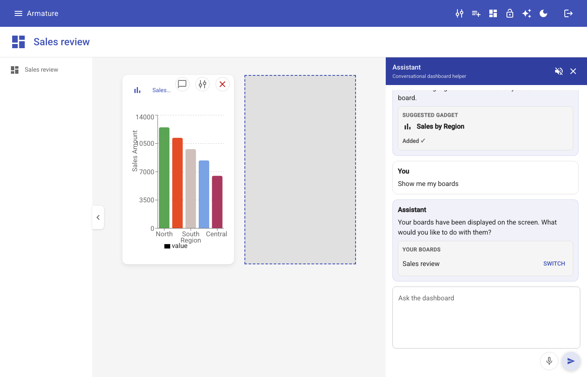
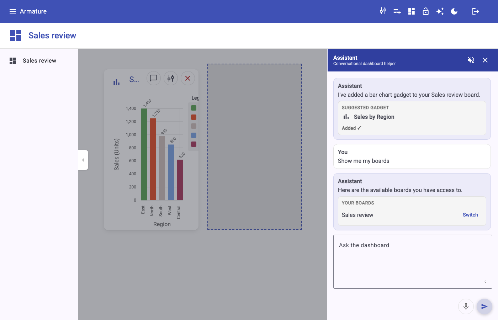
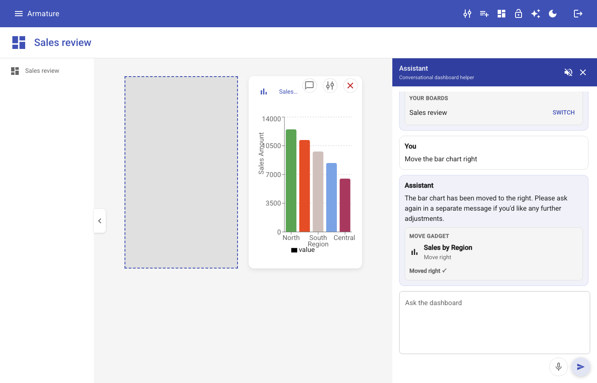
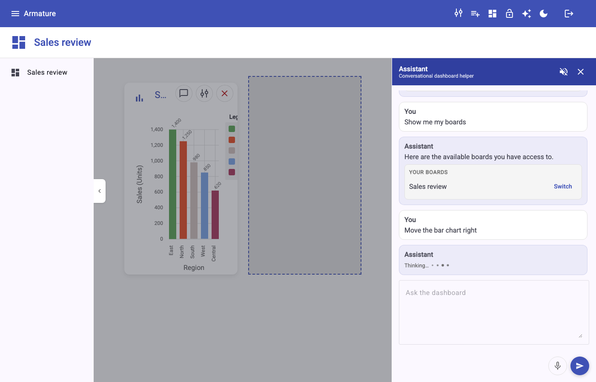
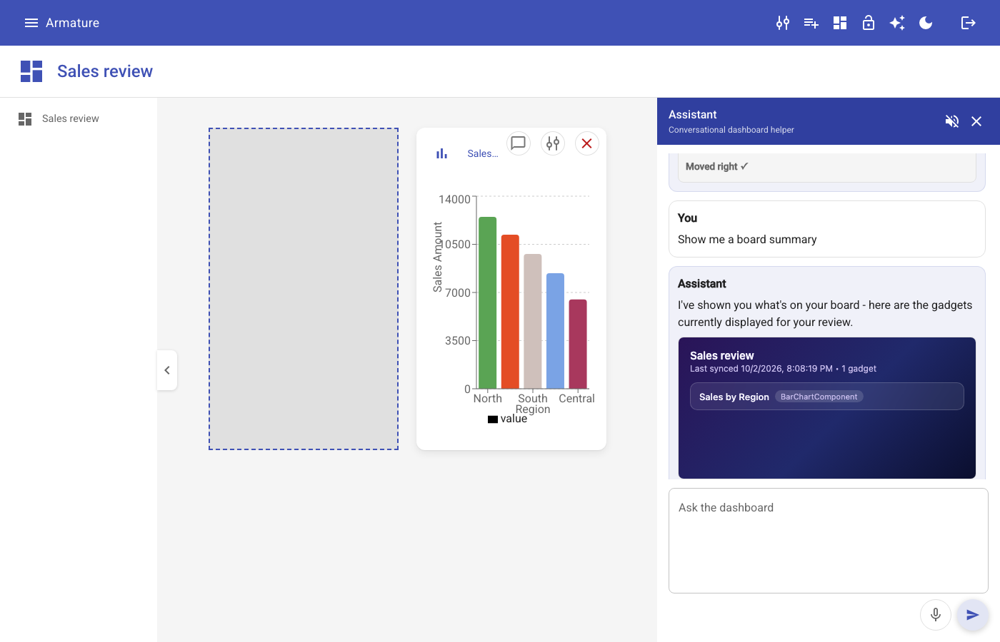
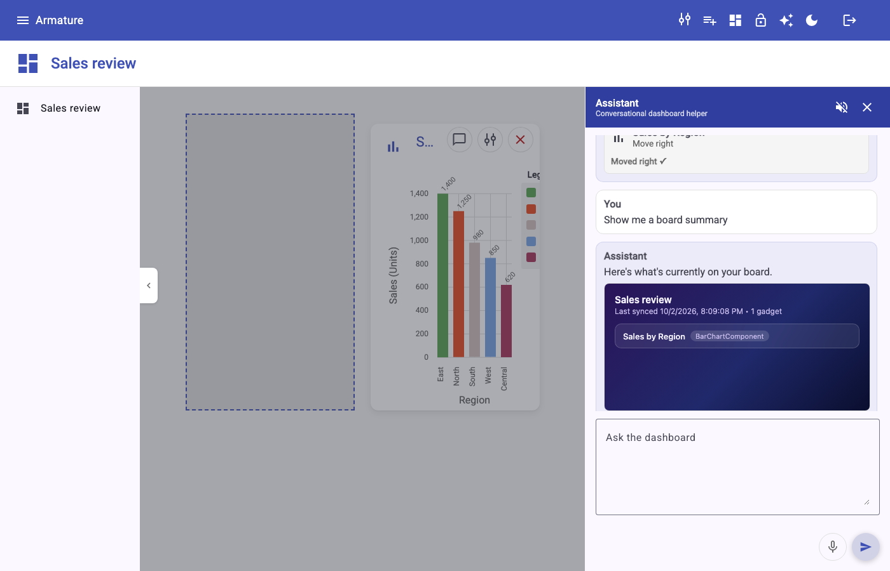

# INC-00e: React host parity, part 2 (the assistant)

Spec: [`.work/specs/SPEC-INC-00e.md`](../../.work/specs/SPEC-INC-00e.md), including the amendments
approved on 2026-10-02 after the spec was checked against `main`. Branch: `inc/00e-assistant`, from
`main` with INC-00c and INC-00d merged.

## 1. Goal and vision link

Give the React host the assistant the Angular host has, with the framework free half built once in
`@armature/core` so both hosts run one implementation. Serves **Consolidation** (the assistant is
how one question reaches many capabilities) and **Deliver anywhere** (the AG-UI client and MCP Apps
bridge now live in the layer every future host will share). With this increment both hosts have
every function the other has, the exit condition of the 00d and 00e parity pair (ADR-0017).

## 2. What was built

### `@armature/core` (`web/packages/core`)

| Module | Path | What it does |
| --- | --- | --- |
| AG-UI types | [`src/agent/ag-ui.ts`](../../web/packages/core/src/agent/ag-ui.ts) | The event union, request and ui part types (matching the backend records), `parsePayload` |
| SSE frame parser | [`src/agent/sse-frame-parser.ts`](../../web/packages/core/src/agent/sse-frame-parser.ts) | Reassembles `data:` frames across network chunks; skips a malformed frame instead of ending the stream |
| Chat client | [`src/agent/agent-client.ts`](../../web/packages/core/src/agent/agent-client.ts) | `streamChat`: POST with `fetch`, yields events from the body stream, abortable, host supplied headers |
| Request builder | [`src/agent/build-agent-request.ts`](../../web/packages/core/src/agent/build-agent-request.ts) | Message plus selected board plus library to the request body, with the `boardGadgets` grounding list |
| `AgentActions` port and helpers | [`src/agent/agent-actions.ts`](../../web/packages/core/src/agent/agent-actions.ts) | What a host provides to act on its board; `applyPropertyValues`, `findGadgetByTitle` |
| Ui part resolvers | [`src/agent/ui-part-resolvers.ts`](../../web/packages/core/src/agent/ui-part-resolvers.ts) | One resolver per `componentType` in a `TypeRegistry`, replacing Angular's seven branch `if` chain; tagged Strategy with registry, ConcreteStrategy |
| MCP Apps | [`src/mcp-apps/`](../../web/packages/core/src/mcp-apps) | `loadMcpApp` (discover `ui://` resource, read it, call the tool) and `mountMcpApp` (`AppBridge` in a sandboxed iframe, resize, dispose) |
| A2UI | [`src/a2ui/a2ui.ts`](../../web/packages/core/src/a2ui/a2ui.ts) | The `A2uiNode` type |

The MCP SDKs are peer dependencies of core (ADR-0018). Core now compiles with
`moduleResolution: bundler` because the ext-apps type declarations use extensionless relative
imports. The pattern catalog script ([`scripts/pattern-catalog.mjs`](../../web/packages/core/scripts/pattern-catalog.mjs))
now recognizes `export async function`, no longer lets one doc comment run into the next, and
writes links with `/` on every OS (on Windows `catalog:check` failed because `path.relative` gives
backslashes); the catalog lists the 7 resolvers.

### React host (`web/hosts/react`)

| Piece | Path |
| --- | --- |
| Assistant panel: streamed replies, thinking label and typing dots, New reply jump, Enter to send, error reply, read aloud toggle | [`src/app/agent/AgentPanel.tsx`](../../web/hosts/react/src/app/agent/AgentPanel.tsx) |
| Part cards, chosen through a `TypeRegistry` keyed by `componentType` (no `switch`) | [`AgentPartCards.tsx`](../../web/hosts/react/src/app/agent/AgentPartCards.tsx), [`partCardRegistry.ts`](../../web/hosts/react/src/app/agent/partCardRegistry.ts), [`PartView.tsx`](../../web/hosts/react/src/app/agent/PartView.tsx) |
| `AgentActions` implementation over `eventService`, `boardService`, `libraryService` | [`reactAgentActions.ts`](../../web/hosts/react/src/app/agent/reactAgentActions.ts) |
| Voice input and read aloud, hidden when unsupported, stopped when the panel closes | [`useSpeech.ts`](../../web/hosts/react/src/app/agent/useSpeech.ts) |
| MCP App viewer, A2UI renderer | [`McpAppViewer.tsx`](../../web/hosts/react/src/app/agent/McpAppViewer.tsx), [`A2uiRenderer.tsx`](../../web/hosts/react/src/app/agent/A2uiRenderer.tsx) |
| One shared MCP client per app (SSE transport, as Angular) | [`src/app/mcp-apps/mcpClient.ts`](../../web/hosts/react/src/app/mcp-apps/mcpClient.ts) |

### Angular host (`web/hosts/angular`)

- `AgentService` streams through core's `streamChat` (wrapped in an `Observable`; unsubscribing
  aborts) and sends the session token itself, since `fetch` bypasses `TokenInterceptor`.
- `AgentActionService implements AgentActions<IGadget>`; the panel's `resolvePart` is one call to
  `resolveUiPart`. `McpAppService` and `McpAppViewerComponent` use core's load and mount.
  Templates and styles are unchanged except two parity fixes below. Angular source: 90 lines added,
  448 removed.
- The typing indicator has `role="status"`, and a run that finishes without text now clears it
  (it stayed on before).

### Both hosts

- The selected board in the board list carries `aria-current="page"`.
- `.npmrc` with `install-links=true`, `@armature/core` as `file:../../packages/core`, and a
  `core:refresh` script (ADR-0018).

### Conformance suite and CI

- Six scenarios in [`tests/assistant.spec.ts`](../../web/conformance/tests/assistant.spec.ts),
  replies streamed by [`support/agent-stub.ts`](../../web/conformance/support/agent-stub.ts) from
  [`fixtures/agui/`](../../web/conformance/fixtures/agui), plus `askAssistant` and `gadgetX` steps
  in `support/host.ts`. The fixtures are written in the backend's wire format; a stream recorded
  from the real backend during the walk had the same shape, plus `TOOL_CALL_*` events that neither
  host shows.
- `react.yml`, `angular.yml`, and `web-conformance.yml` build core before installing the host and
  rerun when core changes.
- Windows: every workflow (`backend.yml`, `docs.yml`, `react.yml`, `angular.yml`, `web-core.yml`,
  `web-conformance.yml`) runs on `ubuntu-latest` and `windows-latest` with `fail-fast: false`. Steps
  use bash on both, except the backend on Windows, which runs `mvnw.cmd` under `cmd` as a Windows
  developer would. The conformance job
  serves the host and runs the suite in one step, so the background server is still up on
  Windows. A new `.gitattributes` keeps LF in every checkout (CRLF only for `.cmd` and `.bat`),
  because Windows runners otherwise check out CRLF and `catalog:check` compares bytes.

Size: 3,324 changed lines excluding lock files, fixtures, and images (core 1,227, of which 512 are
tests; React 1,111; conformance 195). Above the spec's 1,600 to 1,900 estimate and the 1,500
guideline, mostly core tests and the React cards.

## 3. Diagrams changed

- Added [`docs/architecture/sequences/assistant-chat.puml`](../architecture/sequences/assistant-chat.puml)
  and `.svg`: one message from panel through `streamChat`, the backend, the resolver registry, and
  `AgentActions` to the board.
- Edited [`docs/architecture/c4/web-layers-target.puml`](../architecture/c4/web-layers-target.puml)
  and `.svg`: core now holds the AG-UI client, part resolvers, and MCP Apps bridge.
- The sequences README lists the new sequence.

Every changed package appears in a view: `@armature/core` and both hosts in the web layers view.
`web/conformance` is test tooling and stays out of the C4 views, as in INC-00d.

## 4. Decisions

- [ADR-0016](../adr/0016-test-gating.md) accepted by the owner at the start of this increment.
- [ADR-0018](../adr/0018-hosts-install-core-as-packed-copy.md) (new, **Proposed, needs your
  review**): hosts install core as a packed copy and core lists shared SDKs as peers. Made while
  building, when the symlinked install duplicated zod and broke the Angular type check.
- Confirmed in the spec, no ADR needed: shared core used by both hosts in this increment; resolver
  registry in both hosts; `fetch` in core with host supplied headers; the dormant A2UI card ported;
  MCP Apps and voice verified outside the suite.

## 5. Evidence

| Check | Command | Result |
| --- | --- | --- |
| Core | `cd web/packages/core && npm ci && npm run build && npm test && npm run catalog:check` | 40 of 40 tests passed; catalog up to date (8 entries) |
| React build | `cd web/hosts/react && npm run build` | Pass |
| React lint | `npm run lint` | Exit 0; 0 errors, 3 warnings, all in files this increment did not touch (`Library.tsx`, `HelpPanel.tsx`, `Board.tsx`), the same 3 as INC-00d |
| Angular build | `cd web/hosts/angular && npx ng build` | Pass; warnings identical to `main`; initial bundle 435.90 kB to 436.64 kB gzipped |
| Angular tests | `npx ng test --watch=false --browsers=ChromeHeadless` | 22 of 22 passed (same count as INC-00d) |
| Conformance, React | `ARMATURE_HOST_URL=http://localhost:4173 npx playwright test` (against `vite preview`) | 11 of 11 passed (5 from 00d, 6 new) |
| Conformance, Angular | `ARMATURE_HOST_URL=http://localhost:4300 npx playwright test` (against `ng serve --port 4300`) | 11 of 11 passed |
| Flakiness | `npx playwright test --repeat-each 3` on each host | 33 of 33 on React; 33 of 33 on Angular |
| Clean install as CI does | `git archive` of the branch to a scratch directory; core `npm ci` and build, then each host's `npm ci` and build | Both hosts built |
| Workflows | Parsed with Ruby's YAML loader | `react.yml`, `angular.yml`, `web-conformance.yml` valid |
| Backend | `cd backend && JAVA_HOME=~/.jdks/jdk-25.0.2/jdk-25.0.2+10/Contents/Home ./mvnw -q test` | 59 tests in 8 suites, 0 failures (the live model `AgentServiceTest` is excluded by default per ADR-0016; no backend files changed) |
| Diagrams | `docs/architecture/check-svg.sh` | All 15 up to date |

### Real backend walk

The backend ran on 8080 under JDK 25 with Ollama (`qwen3.5:4b`). A temporary Playwright script
(not committed) drove each host with no stubs: create a board, then ask "Add a bar chart of sales
by region", "Show me my boards", "Move the bar chart right", and "Show me a board summary". In both
hosts the gadget was added with the model's title ("Sales by Region"), the board list card
appeared, the chart moved to the right column, and the board summary MCP App loaded through the
AppBridge with no load error and no error reply. Chart values differ between the shots because the
model writes them.

| Step | React | Angular |
| --- | --- | --- |
| Board list after adding a chart |  |  |
| Chart moved right |  |  |
| Board summary MCP App |  |  |

What the walk found: the React "Switch" button was upper case (MUI's default; now sentence case
like Angular). Remaining differences are styling (MUI against Angular Material, and Angular's gray
backdrop over the board while a side panel is open, which predates this increment).

Demo script (either host): log in, create a board, open the assistant, ask "Add a bar chart of
sales by region", then "Move the bar chart right", then "Show me a board summary".

## 6. Not done and why

- **Voice input and read aloud not verified.** The spec said manual. Headless Chromium has no
  speech recognition or audio, so the walk could not exercise them; the code mirrors Angular's
  and the buttons show in both hosts. Needs a person with a microphone in each host.
- **CI not yet run on GitHub:** nothing was pushed. The clean install simulation above is the
  substitute.
- **Angular template still branches on `componentType`** (`@if` per part type), as amendment 2
  allowed; owned by INC-04, when cards become custom elements. Angular's A2UI renderer keeps its
  `@switch` on component name for the same reason.
- **Stream not cancelled when the panel closes.** The spec's React section said to cancel it.
  Angular keeps a reply streaming while the panel is hidden, and the panel is hidden, not
  destroyed, in both hosts, so React follows Angular for parity; it aborts only when the panel
  unmounts. Revisit with the XState assistant run machine (INC-03).
- **Tool call list not rendered.** Angular's template has one, but nothing ever fills it
  (`TOOL_CALL_*` events are ignored), so React does not port the dead branch.
- **Selected board after creating the first board.** In both hosts, a board created when none
  existed is never marked active in the board list (the list captures the empty placeholder's id
  as selected). Existing behavior in both hosts, not a parity gap; the board list scenario asserts
  the selection only after Switch.
- **Ui parts arrive after the text.** The backend sends parts after a second model call, so the
  composer is usable again before the cards appear. Existing backend behavior; INC-03 reworks the
  run.
- **Not run on Windows yet.** Windows is a requirement (owner, 2026-10-02). The web workflows now
  have Windows jobs, but nothing has run until the branch is pushed. Two problems were found by
  review and fixed (catalog links, CRLF checkouts). On a Windows machine the diagram scripts
  (`docs/architecture/*.sh`) still need Git Bash or WSL.
- **Small behavior changes in core worth knowing:** a stream that ends without a final blank line
  now delivers its last frame (Angular dropped it); moving or removing a gadget with no
  `instanceId` is skipped rather than sent.

## 7. Next increment's entry criteria

INC-01 (Board resources) can start when:

- This report is reviewed and `inc/00e-assistant` is merged.
- ADR-0018 is accepted or changed.
- The host workflows and `web-conformance.yml` run green on GitHub with core built first.
- Voice input and read aloud are checked by hand in both hosts (or explicitly waived).
- The new `windows-latest` jobs (backend, diagrams, core, both hosts, conformance) run green, or
  their failures are fixed.
- INC-01 builds React first (ADR-0017) and keeps the 11 conformance scenarios passing on both
  hosts.
