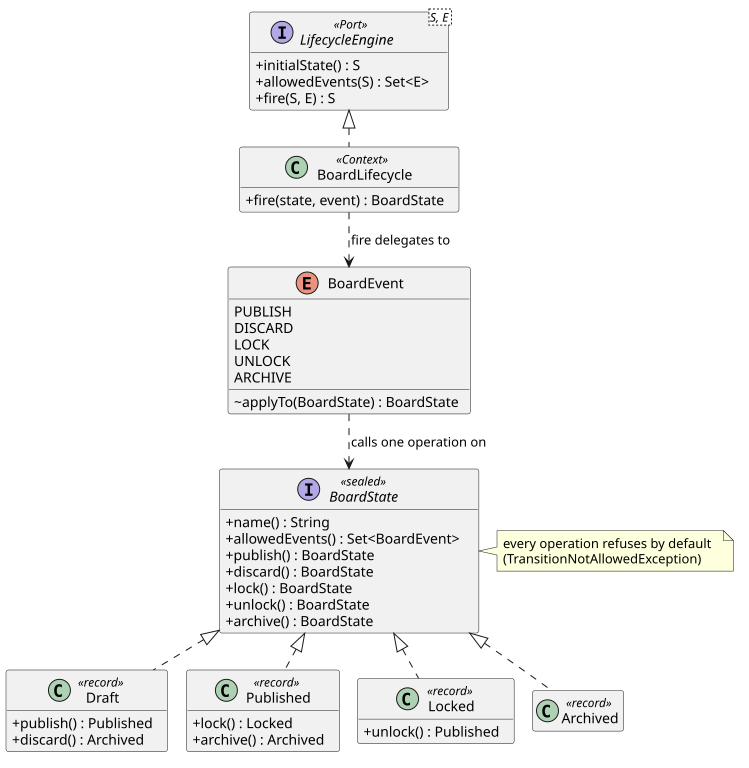

# State

Boards, capabilities, pinned answers, and composition tasks each move through a lifecycle, and
the lifecycle decides what a person or an agent may do next. Making those lifecycles explicit
State pattern classes is what lets Armature show only the actions that are possible right now
(ADR-0004, ADR-0006).

## Intent

Let an object change its behavior when its internal state changes, by giving each state its own
class instead of branching on a status field.

## The problem in Armature

Board rules were implied by flags such as `locked`, checked wherever an edit happened. Every new
rule meant another `if` in another place, the UI repeated the same checks, and nothing listed
what a board in a given state could do. The State pattern replaces that with one class per state,
each knowing exactly which events it accepts.

## Participants

| Role | Class | Responsibility |
| --- | --- | --- |
| Context (port) | [`LifecycleEngine`](../../backend/src/main/java/com/addf/backend/armature/lifecycle/LifecycleEngine.java) | What every lifecycle offers callers: initial state, allowed events, fire |
| Context | [`BoardLifecycle`](../../backend/src/main/java/com/addf/backend/armature/board/BoardLifecycle.java) | Hands each event to the current state; holds no rules itself |
| Event | [`BoardEvent`](../../backend/src/main/java/com/addf/backend/armature/board/BoardEvent.java) | Names an event and the state operation it triggers, so firing needs no `switch` |
| State | [`BoardState`](../../backend/src/main/java/com/addf/backend/armature/board/BoardState.java) | Sealed interface; every operation refuses by default |
| ConcreteState | [`Draft`](../../backend/src/main/java/com/addf/backend/armature/board/Draft.java), [`Published`](../../backend/src/main/java/com/addf/backend/armature/board/Published.java), [`Locked`](../../backend/src/main/java/com/addf/backend/armature/board/Locked.java), [`Archived`](../../backend/src/main/java/com/addf/backend/armature/board/Archived.java) | Each overrides only the transitions it allows |

## Class diagram

Source: [`state.puml`](state.puml). The transitions:

| From | Event | To |
| --- | --- | --- |
| `DRAFT` (initial) | `PUBLISH` | `PUBLISHED` |
| `DRAFT` | `DISCARD` | `ARCHIVED` |
| `PUBLISHED` | `LOCK` | `LOCKED` |
| `PUBLISHED` | `ARCHIVE` | `ARCHIVED` |
| `LOCKED` | `UNLOCK` | `PUBLISHED` |
| `ARCHIVED` | none (terminal) | |

A state diagram generated from the lifecycle's JSON definition replaces this table in INC-02.

## SOLID callout

**Open/Closed.** Adding a state adds a record and one `permits` entry; `BoardLifecycle` and the
other states do not change. The sealed interface lets the compiler list every state, so nothing
needs a `switch` or `instanceof` to find them. **Dependency inversion** shows in
`LifecycleEngine`: callers depend on the port, not on board classes.

## Tests that prove it

[`BoardLifecycleTest`](../../backend/src/test/java/com/addf/backend/armature/board/BoardLifecycleTest.java)
fires every event in every state (20 cases) against a transition table written independently of
the state classes, and checks that each state's `allowedEvents()` matches what it accepts.

## Exercise

Add a `RESTORED` state: an archived board can be restored, and a restored board can be published
again. Add a `Restored` record, a `RESTORE` event, override `restore()` in `Archived`, and
extend the table in `BoardLifecycleTest` first. Notice which existing classes you did not have
to open.
