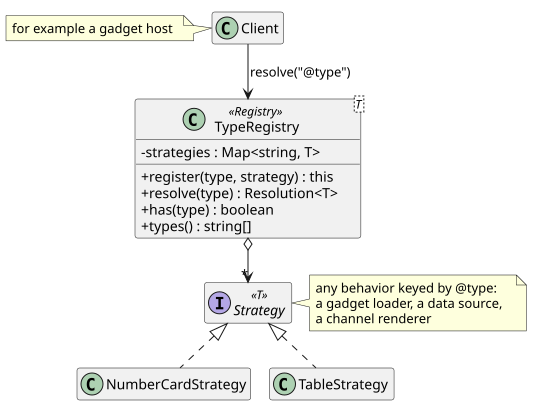

# Strategy with registry

Consolidation without a new monolith depends on one move: supporting a new gadget, data source,
or channel adds a class and a registration, never an edit to code that already works. This
pattern is that move, and every extension seam in the plan uses it.

## Intent

Define a family of interchangeable behaviors, and select one at runtime by looking it up by name
(here, by `@type`) instead of branching on the name.

## The problem in Armature

The Angular host once chose a gadget component with a `switch` on `componentType`, so every new
gadget edited that `switch`. It now uses a lookup table
([`gadget-registry.ts`](../../web/hosts/angular/src/app/gadgets/gadget-registry.ts)), but that
table is Angular specific, and data sources, channel renderers, and gadget representations will
need the same thing in every host and in the backend.

## Participants

| Role | In Armature | Responsibility |
| --- | --- | --- |
| Registry | [`TypeRegistry`](../../web/packages/core/src/type-registry.ts) | Maps each `@type` to its strategy; refuses duplicates; reports unknown types clearly |
| Strategy | The registered value, for example a gadget element loader or a data source | One behavior for one `@type` |
| Client | The code that asks the registry, for example a gadget host | Calls `resolve(type)` and uses the strategy without knowing which one it is |

## Second example: assistant ui parts (INC-00e)

The assistant's reply carries ui parts, each with a `componentType` (`gadget-suggestion`,
`gadget-move`, `row-layout`, and four more). The Angular panel used to decide what to do with a
part in a seven branch `if` chain, and every new tool meant editing it. Now
[`ui-part-resolvers.ts`](../../web/packages/core/src/agent/ui-part-resolvers.ts) in
`@armature/core` registers one resolver per `componentType` in a `TypeRegistry`, and both hosts
call `resolveUiPart(part, actions)`:

| Role | In the assistant |
| --- | --- |
| Registry | The `TypeRegistry<UiPartResolver>` built by `createUiPartResolvers()` |
| Strategy | `resolveGadgetSuggestion`, `resolveGadgetMove`, `resolveRowLayout`, and the rest; each looks up what the part refers to and applies it |
| Client | Each host's panel, through `resolveUiPart`, which never branches on `componentType` |

The resolvers reach the board through `AgentActions`, a port each host implements with its own
services, so the same resolver changes a React board and an Angular board. The React host uses a
second registry, [`partCardRegistry.ts`](../../web/hosts/react/src/app/agent/partCardRegistry.ts),
to choose the card that shows each part, so adding a part type is one resolver in core and one
card per host, with no existing code edited.

## Class diagram

Source: [`strategy-registry.puml`](strategy-registry.puml).

## SOLID callout

**Open/Closed.** A new `@type` is one `register` call next to the new strategy; clients and other
strategies do not change. **Dependency inversion** follows when the strategy type is an interface
owned by the client (for example a future `DataSourceStrategy`), so the client never depends on
a concrete implementation.

## Tests that prove it

[`type-registry.test.ts`](../../web/packages/core/src/type-registry.test.ts): resolving a
registered type, reporting an unknown one with the types that are registered, refusing a
duplicate, and listing types.
[`ui-part-resolvers.test.ts`](../../web/packages/core/src/agent/ui-part-resolvers.test.ts): every
backend `componentType` has a resolver; each resolver against a fake `AgentActions` (found, not
found, row out of range); unknown part types pass through unchanged.

## Exercise

Create a `TypeRegistry` of number formatters keyed by `@type` (`Currency`, `Percentage`), then add
a third (`Duration`) and notice that neither the registry nor the code calling `resolve` changes.
